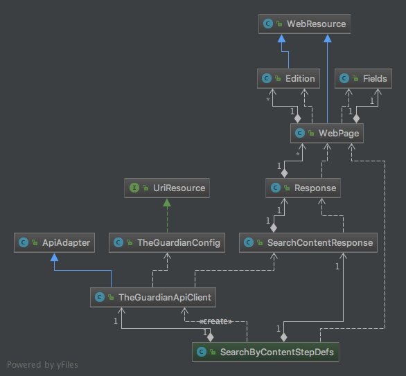

# DelRoo Tas
Project to experiment and practice nice ideas and good behavior

### Overview
Project scope is to exemplify a sample approach to create a _TheGuardian_ API client.
At the same time it contains a solution to test whether the endpoints correctly perform their responsibilities.
 
The development path is following a test/behavior driven approach, i.e. any framework capability was implemented based 
on acceptance requirements.

### Setup
This solution is developed using following technologies/tools:
- Java 8 JDK (version '1.8.0_73')
- Apache Maven 3 (version '3.3.9')
- Git (version '2.7.4')
- Jenkins 2 (version '2.73.2')

_NOTE: Ensure this are properly installed on local machine to get the project up-and-running._

### Executing tests
Clone the project on local machine, change directory inside *delroo-tas* folder and run *mvn clean verify*
This will execute unit and acceptance tests.
 
To generate cucumber reports run *mvn exec:java* inside the project root folder.
Reports home page can be found by loading *delroo-tas/target/cucumber-html-reports/overview-features.html*

The acceptance tests are configured to be executed in parallel. This is implemented using *cucumber-jvm-parallel-plugin*
and *maven-failsafe-plugin*. The reporting module will handle duplicated file reports only if executed after test run 
(GenerateCucumberReports.main() or mvn exec:java)  

### CI/CD
For the CI/CD pipeline we need to ensure different validation phases. Eventually the unit tests and mock profiles will
be checked at PR/integration phase while the E2E will be executed at the acceptance level.

Inside *delroo-tas/jenkins* folder there is Jenkins job *config.xml* file. 
To upload the job into Jenkins, please follow the next steps:

NOTE: Ensure the following plugins are installed:
- https://github.com/damianszczepanik/cucumber-reporting
- https://wiki.jenkins.io/display/JENKINS/Conditional+BuildStep+Plugin

1. create a new folder inside *.jenkins/jobs*, e.g. delroo-tas
2. copy the *config.xml* inside the created folder
3. in Jenkins web app go to *Manage Jenkins -> Reload Configuration from Disk*, then Confirm. This should pick up the new job.
4. on the job list, there should be now a new job called delroo-tas, open it and click on *Build Now*

### Project configuration
Support for external configurations is implemented using [TypeSafe Config](https://github.com/lightbend/config])
This approach allows simple config parsing, tree models as well as config bean factory, e.g. *TheGuardianConfig.java*

To provide a custom api-key just call the execution with an additional param -DPROVIDED_API_KEY=custom-api-key

### Design and interaction diagram

### Improvements
- Implement generic filters for each API endpoint, e.g. searchXYZ(withFilters(A, B, C))